# 🥇 GITHUB

> En esta guía para principiantes te enseño a entender cómo moverte por estos lares **desde 0**, subir tus proyectos con sus ramas y buenas prácticas!

---

## 🔍 Que es Github?

Es una web (desde donde me estás leyendo vaya xd) donde guardas proyectos (**repositorios**). Te permite ver código, historial de cambios y colaborar!

Un **repo** contiene archivos, dichos historiales de cambios (**commits**) y ramas (**branches**).

## 📌 Cómo moverte por la web

Si partes _desde un perfil_, directo al **paso 1**! Si partes _desde el enlace al repo_ pues desde el **paso 2**!:

1. Ve a la pestaña **repositories** → verás todos los repos! Ve al que quieras y clic en él, se te abrirá con todos sus archivos y sus cosas.
#### 📍 Vista previa del perfil
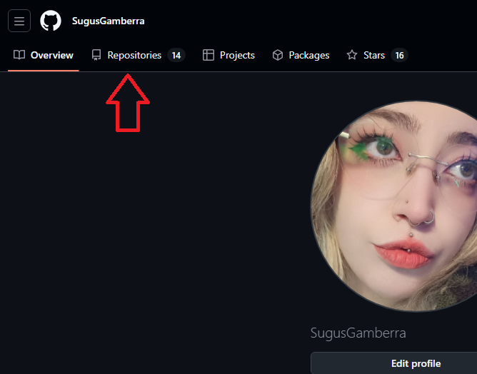
2. **El `README.md` aparece abajo de donde están las carpetas/archivos**: es la carta de presentación del repo. Léela **SIEMPRE**! Es contenido de _alto valor_
#### 📍 Vista previa del readme
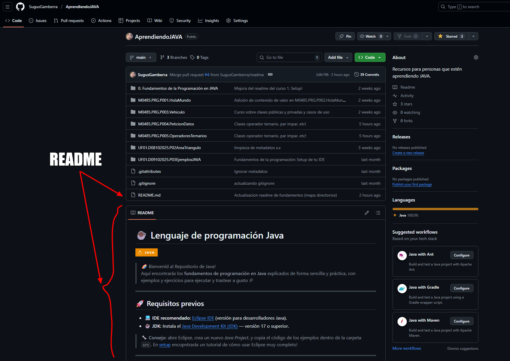
3. Haz clic en un archivo (por ejemplo `0. Fundamentos de la Programación en JAVA`) para ver su contenido.
#### 📍 Vista previa del contenido de una carpeta o archivo clicando en él
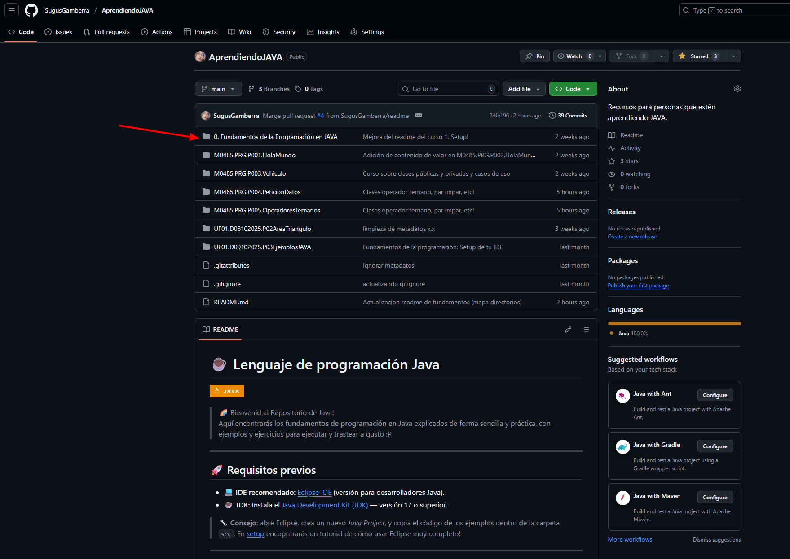
4. En la parte superior hay pestañas: *Code*, *Issues*, *Pull requests*, *Actions*, *Projects*, *Wiki*, *Settings*. Te recomiendo que veas cada una para que te familiarices!
#### 📍 Vista previa de las pestañas
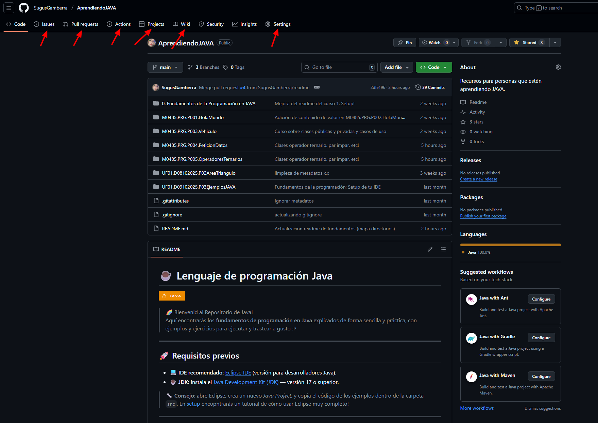

## ✏️ Conceptos clave

- **main**: Versión oficial y estable.
- **branch**: Copia del proyecto para trabajar sin romper el `main`.
- **commit**: Los cambios con un mensaje descriptivo (ej: "formulario añadido")
- **push**: Subida de los **commits** al repo
- **pull request**: Pide que tus cambios de una rama se fusionen en **main**

## ✔️ Buenas prácticas

- Trabaja **siempre** en ramas para nuevas funcionalidades o cambios tochos
- **Mensajes de commit claros y cortos**, si es un proyecto para ti como mejor te apañes ;P A mí me gustan muy descriptivos porque soy Dori. Ej:
    - `git commit -m "feature/login"`
    - aaaaa, pero para mí... `git commit -m "actualización del login, probando otro método/estética/whatever"`
- **Mejor hacer commits pequeños y frecuentes** a uno hiper tocho que te reviente todo tu main
- **Borra ramas cuando las fusiones** para no acumular basura

---

# 🥈 GIT

## ✨ Descargarlo

1. Entra en este 👉 [enlace](https://git-scm.com/install/windows)
2. Descarga la versión para tu SO
3. Abre el instalador y to palante, next next next a todo **MENOS** cuando pregunte "**Default editor for Git**", ahí eliges tu **IDE**!!! Si no sabes que IDE poner, dejalo todo tal cual y palante hasta que veas el botón de `Install`.

## 🔍 Que es git bash?

Cuando esta instalación termina ahora encuentras al hermosísimo **Git Bash**. Es tan solo una **terminal** que entiende los comandos de Git.

La usarás para hacer:
- `git init`
- `git add`
- `git commit`
- `git push`
- `git pull`
- Crear ramas, etc...

### 🎯 Cómo acceder a git bash?

Entras en una carpeta, clic derecho sobre el espacio en blanco y verás "`Open Git Bash here`". También la puedes abrir desde el menú inicio pero yo prefiero la del clic derecho :P

Una vez lo tengas abierto toca configurarlo! Escribe lo siguiente:

```bash
git config --global user.name "TU NOMBRE"
git config --global user.email "TU-EMAIL-DE-GITHUB"
```

Así github sabe que tú eres el que hace los commits.

Por si las... Y ya lo tenías instalado de hace siglos pero jamás lo usaste y no sabes si está conectado o no y quieres comprobarlo:

```bash
git config --global --list
```

Si te sale algo como username, email y tal es que lo tienes, si no, no está hecho y sale hacerlo ;3

Ahora, existen dos formas de conectarse y que **git hable con github**:

1️⃣ HTTPS

- No necesita `keygen`
- Funciona siempre
- Pide login/token a veces

2️⃣ SSH

- Necesitas generar `keygen`
- Se configura 1 vez
- Nunca más te pide nada

Ese `keygen` es una clave **SSH**. Esto es como una llave privada con su cerradura para que tu PC pueda hablarse con github sin pedirte jjjjjjjamás usuario o contraseña:

> Par de llaves criptográficas:
> 🔑 Tu PC = llave privada
> 🔒 GitHub = llave pública

Como antes, si es algo que hiciste hace siglos y quieres comprobar si lo tienes hecho escribe en git bash:

```bash
ls ~/.ssh
```

Si te sale 

```pgsql
ls: cannot access '/c/Users/tuusuario/.ssh': No such file or directory
```

Es que no lo tenías, así que a hacerlo!

1. Escribe en git bash:
```bash
ssh-keygen -t ed25519 -C "tu-email-de-github"
```
2. Dale enter a todo, no cambies nada, topalante. 
3. Para poner la clave en github escribe lo siguiente, selecciona el resultado y copialo:
```bash
cat ~/.ssh/id_ed25519.pub
```
4. Ve a github:
    - Arriba a la dcha - settings
    #### 📍 Vista previa de settings
    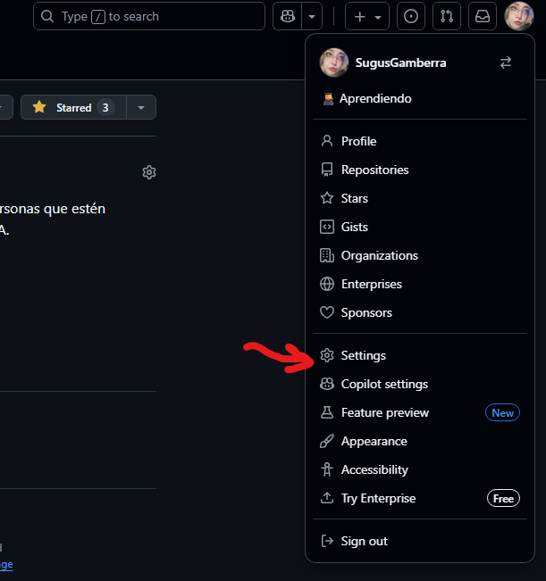
    - Menú izquierdo - SSH and GPG keys
    #### 📍 Vista previa de SSH
    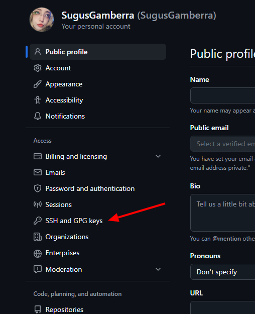    
    - Dale a `new SSH key`
    #### 📍 Vista previa de nuevo ssh
    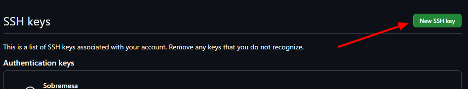
    - En `título` ponle uno identificativo de tu pc
    #### 📍 Vista previa de add ssh
    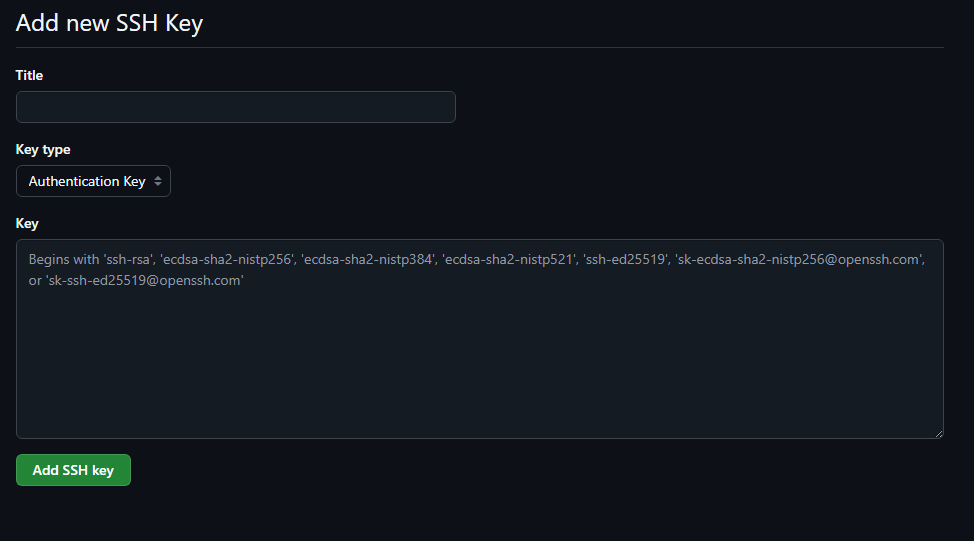
    - En `key` pega tu clave y guarda!

> 🌐 _Por qué te recomiendo hacer esto?_ Porque es una capita de seguridad, nunca está de más, es un protocolo que te permite conectarte y autentificarse de forma segura en los servidores de github, como te dije, sin usar username ni contraseña en cada conexión. Usa ese par de llaves criptográficas para verificar tu identidad y permitir un acceso **SEGURO** y **CIFRADO** a tus repos!!!

---

> Ahora sí puedes crear repos y subir cosas de chill!

---

# 😼 AHORA USEMOS TODO!!!

## 🔥 Crea un repo en github

1. Ve a github (web) - Tu perfil - Repositories - `New Repository`
2. Ponle el nombre que creas conveniente, si es la primera vez ponle `Prueba`
3. Marca "`Add a README`", no hace falta de momento añadir licencias ni gitignores!!
#### 📍 Ejemplo de yo creando este repo desde el que me lees
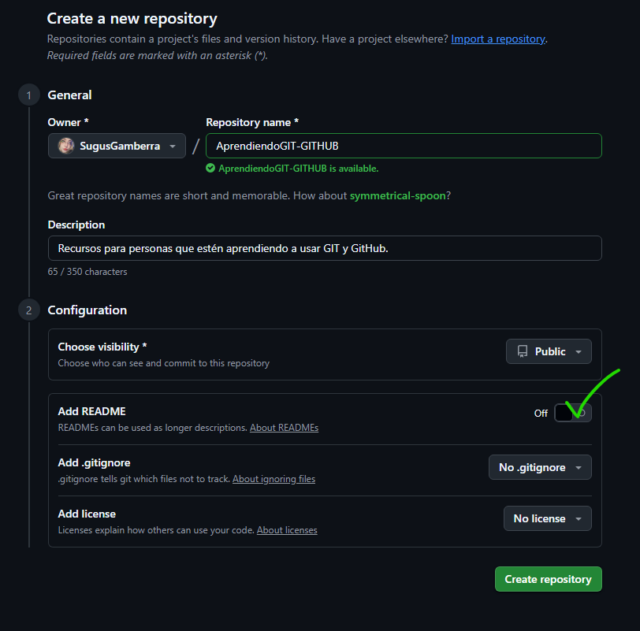

Ahora que lo tienes creado en github, vas a tu pc y por hacer la prueba y que veas que todo funciona smooth...

## 🧩 Subir proyecto desde tu PC

Si tienes un proyecto ignora el _punto 1_ y **ve al 2**, si no, mejor así haces alguna webadita por probar y luego la borras o lo que quieras :P

1. Crea una carpeta en algún lugar accesible, ponle "`Prueba`" de nombre. Dentro haz **clic derecho** y añade un `Nuevo - Documento de texto (.txt)`, dale **título**, ponle dentro un algo para no subirlo vacío, guarda y ya!
2. **Clic derecho en tu carpeta del proyecto**, `Open Git Bash here` y ve escribiendo lo siguiente y dándole a enter **por cada línea**, IMPORTANTISIMO!! No es todo a la vez vale? HAHAHAHA que ya la lió un compi de clases por intentar flexearse y hacer mansplaining xD (jamas le pickearon uwu) En la línea 4 del remote add, en tu proyecto de github creado verás que salen las instrucciones de esto, igualmente por ahí verás el enlace a tu repo, pero vamos la estructura es la de la línea 4 ;D
```bash
git init
git add .
git commit -m "prueba-o-nombre-de-tu-proyecto"
git remote add origin https://github.com/USER/Prueba.git
git branch -M main
git push -u origin main
```

> **NOTA**: Si no te sale Open Git Bash here, mira de darle a `Mostrar más opciones`
> #### 📍 Vista previa de mostrar más opciones
> 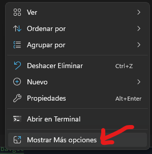

Has creado tu proyecto con éxitooo! Supongamos que **tu proyecto crece**, añades, modificas, quitas... Para ello aprendemos a trabajar en ramas ;3

En tu carpeta del proyecto por probar, métele otro .txt con contenido dentro diferente al inicial, por que sea más visual. Y al inicial cambia su contenido y ponle "hola caraqlo", ahora en git bash:

1. Creamos la rama
```bash
git switch -c probando
git add .
git commit -m "Modificación y adición de .txt"
git push -u origin probando
```
2. Ve a tu repo de github, verás que te sale arribita "`Compare & pull request`", abrelo, añade si quieres una descripción y crea el PR
#### 📍 Vista previa de todos los pasos de compare and pr
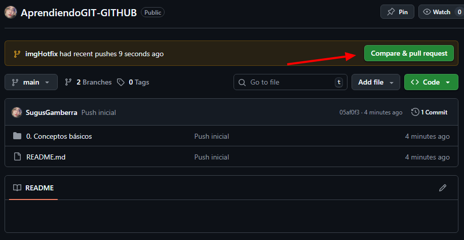
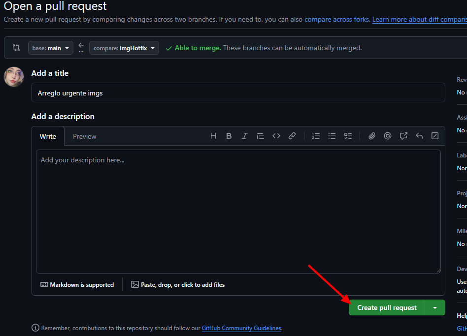
3. Revisa y pulsa `merge pull request`, y ya borras la rama que te saldrá un botón de `delete branch`
#### 📍 Vista previa de todos los pasos del merge
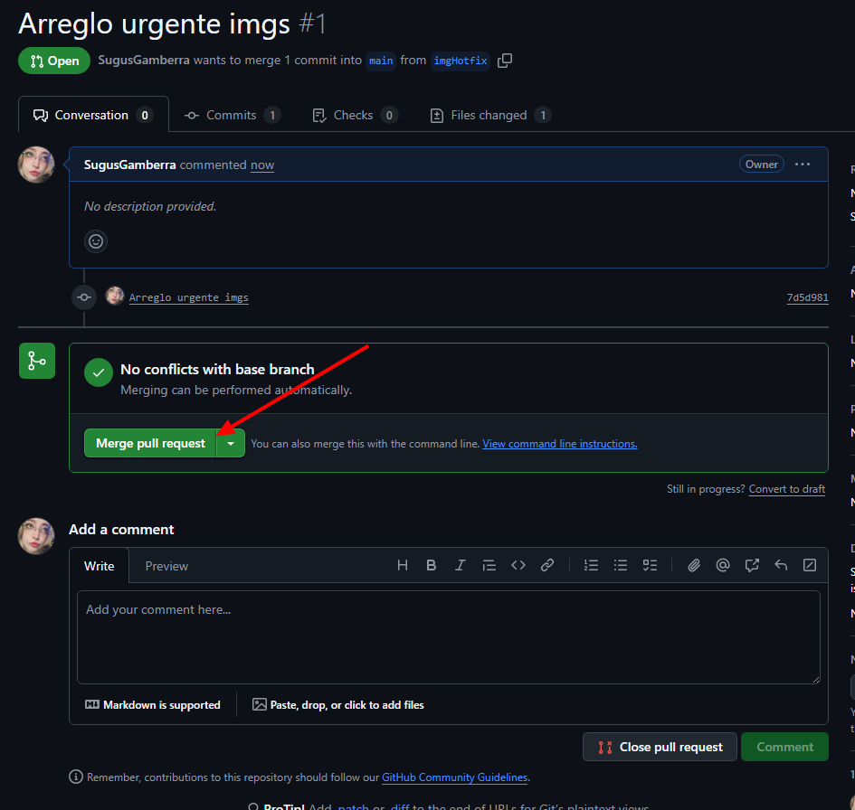
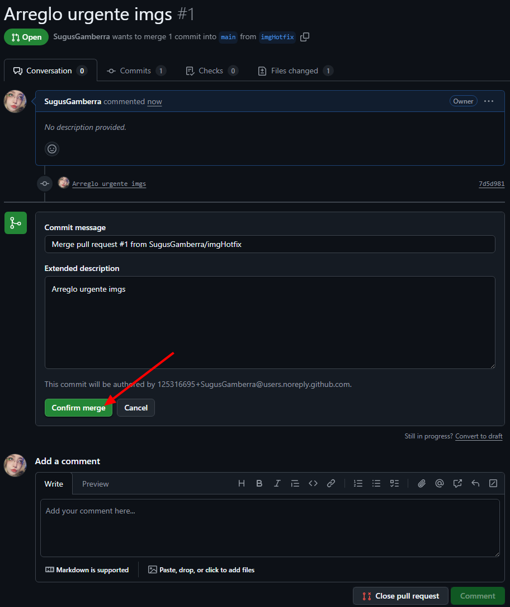
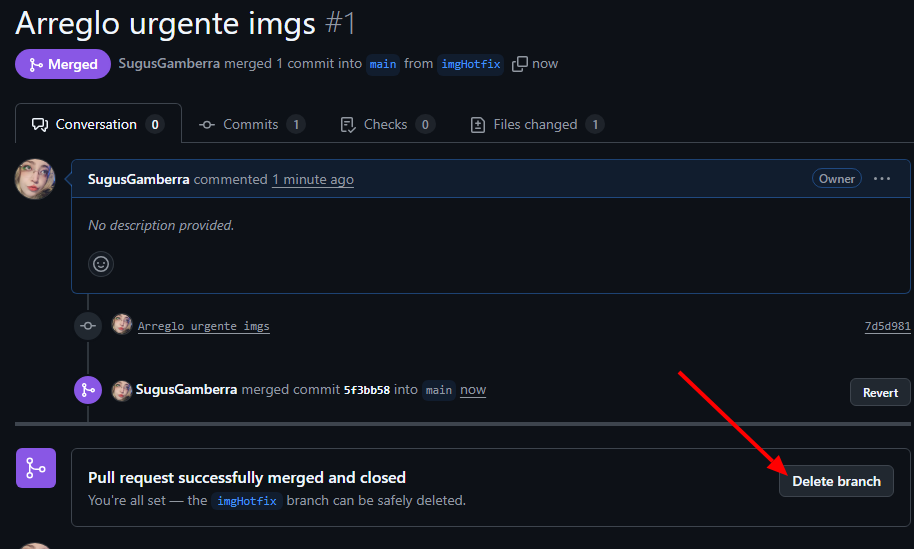
4. En git bash **eliminamos la rama** de forma local, ya que no la usaremos mas:
```bash
git switch main
git pull origin main
git branch -d probando
```

---

Y ya estaría!

Sé que es mucho texto, pero muy necesario para aprender a usar esta webadita ;3 Y lo próximo seran cheat sheets! Enjoy :P